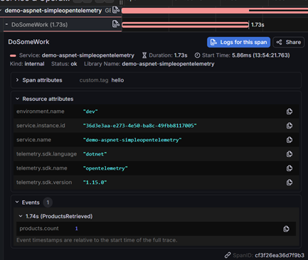

# SimpleOpenTelemetry examples

This folder contains SimpleOpenTelemetry examples in ASP.NET core and Console apps exporting telemetry to:

- Console (you can turn off in appSettings.Development)
- A local otel-lgtm + jaeger server in docker

It collects:

- Logs
- Traces (AspNetCore, HttpClient, SqlClient, EFCore)
- Metrics (AspNetCore, HttpClient, SqlClient, Runtime)
- Resource information (host, container, os, process)

The hooks to SimpleOpenTelemetry to configure OpenTelemetry are 'AddSimpleOpenTelemetry()' and after build (the option to check your config has core settings correct) 'SimpleOpenTelemetryValidate()' in [Program.cs](./aspnetcore/Program.cs).

There are also EventListeners for OpenTelemetry and SimpleOpentelemetry events setup in the Program.cs of the examples. You can view any warnings or errors with your configuration from these outputs. as `[OTel/<level>] [OpenTelemetry-Sdk]` and `[S-Otel/<level>] [SimpleOpenTelemetry-Core]` for opentelemetry and simpleopentelemetry respectively

To reduce console noise, event listeners can be commented out in Program.cs and the "console" exporter entries in the appsettings.Development.json removed.


### Prerequisites

- .NET 10.0 or later
- Grafana LTGM stack + Jaeger instance for OTLP traces (to run locally see [docker-compose](../grafana-lgtm-otel-collector/docker-compose.yaml)


## Using the sample with the local OTEL server

To use the app without cloud dependencies, first run

```
cd ./otel-servers/jaeger-lgtm-otel-collector
docker-compose up
```

remove the local grafana / jaeger when finished with

```
docker-compose down
```

This uses local volumes so for a full data flush delete the volumes in docker.

## Setup the config

For either example, To use config file loading, in the project folder:
    cp appsettings.Example.json appsettings.Development.json
OR to use Env vars, you can set any / all values based on the above appsettings
eg:
```powershell
$Env:SimpleOpenTelemetry__Trace__Settings__SetErrorStatusOnException = "true"
```

Make adjustments to these files / env vars based on the different examples below.

## Using the AspNetCore example

This uses a WebApplicationBuilder generic host setup.
To enable EFCore and SqlClient instrumentation / logging, With a mssql localdb running, edit appsettings.Development and set "UseSqlEfCore": "true"

To run:

```
cd ./example-apps/localdev/aspnetcore
..setup the config file...
dotnet run
```

To generate metrics / logs / traces:

When launched, navigate to http://localhost:5056/

Navigate to other links and back to home to trigger log / trace / efcore+sqlclient (if enabled) telemetry on the home page muitple times.


## Using the console example

This uses a generic host setup in the default config. to test with a non-generic host setup change the setting 'UseGenericHost' to 'false' in the appsettings.Development.json

This example will run some http calls and traces you can view in your local telemetry servers

To run:

```
cd ./example-apps/localdev/console
..setup the config file...
dotnet run
```

It runs the below:

1. **Configuration**: Loads OpenTelemetry via SimpleOpenTelemetry exporter/trace/metrics/logging settings from `appsettings.Development.json` or environment variables
2. **Initialization**: Sets up SimpleOpenTelemetry with loaded settings
3. **HTTP Calls**: Makes traced HTTP requests to https://checkip.amazonaws.com and a failing (auth required) https://api.github.com/users/torvalds
5. **Tracing**: All operations are automatically traced and exported

Press any key to exit

## Startup time

For either example, a console output stopwatch will show how long it took to run. Just search for "AddSimpleOpenTelemetry() took: X ms".


## Viewing Telemetry

You can view the telemetry collected on your [local grafana server](http://localhost:3000/) and [local jaeger server](http://localhost:16686)


### Grafana

For viewing all telemetry at a high level, navigate to Connections > Data Sources and you can hit the 'Explore data' on each of the service types or just Explore.

On the data explorer pages click 'Go queryless' to get a quick glance at the data comingh through.

To examine the traces that are generated in HomeController.cs, go to the Explore section -> Select tempo in the top left -> set query type 'search' -> set span name = 'DoSomeWork' you can view the demo trace information sent. This includes span attributes (tag) and events as pictured.

If you enable EFCore as mentioned before, you will see Entity framework and SqlClient traces here too under spans 'EFCoreGetProducts' and 'Select [Products]'.




### Jaeger UI (using OTLP)

- Navigate to the local url
- Select "console-simpleopentelemetry" from the service dropdown
- View traces in real-time


## Using the sample with Azure

You can deploy this app to Azure by setting an appsettings.Production.json with one of the [SimpleOpenTelemetry example-configs](../example-configs/azure/) and following setup instructions there. Ensure you have an "UseSqlEfCore": "false" item and the "Sources": [] entry the same as the appsettings.Example.json entry.

- Go to your Application Insights resource in Azure Portal
- Verify data is flowing using this KQL [Azure monitor exporter] (../README.md#azure-monitor-aspnetcore)


## Using the sample with AWS

You can deploy this app to AWS by setting an appsettings.Production.json with one of the [SimpleOpenTelemetry example-configs](../example-configs/aws/) and following setup instructions and telemetry verification in the AWS cloud example here: [example-apps/cloud/aws/ecs/README.md](../cloud/aws/ecs/README.md).


## Using the sample with GCP

You can deploy this app to GCP by setting an appsettings.Production.json with one of the [SimpleOpenTelemetry example-configs](../example-configs/gcp/) and following setup instructions and telemetry verification in the GCP cloud example here: [example-apps/cloud/gcp/cloudrun/README.md](../cloud/gcp/cloudrun/README.md).


## Using the sample with New Relic


You can deploy this app to New Relic by setting an appsettings.Production.json with one of the [SimpleOpenTelemetry example-configs](../example-configs/newrelic/) and following setup instructions and telemetry verification there.
